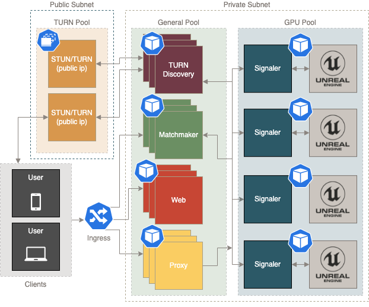

# Unreal Pixel Streaming on OKE

This project represents a scalable pixel streaming deployment on Oracle
Container Engine for Kubernetes (OKE). It is built intentionally using
the simplest constructs and/or dependencies with minimal customizations
to original samples from Epic Games

## Architecture

## Services

| Service | About |
|--|--|
| [signalserver](./src/signalserver) | Unreal "Cirrus" signal server with extensions |
| [matchmaker](./src/matchmaker) | Unreal "Matchmaker" server with extensions |
| [player](./src/player) | Unreal sample player (web) service with modifications |
| [proxy](./src/proxy) | NGINX reverse proxy for individual streamer API interactions |
| [router](./src/router) | Traefik proxy router (ingress) |
| [turn](./src/turn) | coTURN daemonset for STUN/TURN |
| [turn-api](./src/turn-api) | `turn` pool WebRTC configuration discovery/aggregator |
| - | - |
| [kubetools](./src/kubetools) | Container for sidecar/init `kubectl` utilities in cluster |
| [unreal](./src/unreal) | Sample `Dockerfile` for an Unreal Pixel Streaming projects |

## Usage

See [./deploy](./deploy/README.md)

## Resources

- [Oracle GPU](https://www.oracle.com/cloud/partners/gpu.html)
- [Pixel Streaming](https://docs.unrealengine.com/4.27/en-US/SharingAndReleasing/PixelStreaming/)
- [Matchmaking](https://docs.unrealengine.com/4.26/en-US/SharingAndReleasing/PixelStreaming/Hosting/#multiplefullstackswithmatchmaking)
- [Unreal Containers](https://unrealcontainers.com/docs/use-cases/pixel-streaming)
- [PS in Linux containers](https://adamrehn.com/articles/pixel-streaming-in-linux-containers/)
- [ue4-docker CLI](https://github.com/adamrehn/ue4-docker)
- [Azure Unreal Pixel Streaming example](https://github.com/Azure/Unreal-Pixel-Streaming)
- [GPU streaming with WebRTC](https://cloud.google.com/architecture/orchestrating-gpu-accelerated-streaming-apps-using-webrtc)
- [coTURN](https://github.com/coturn/coturn)
- [NVIDIA GPU Monitoring](https://docs.nvidia.com/datacenter/cloud-native/gpu-telemetry/dcgm-exporter.html#gpu-telemetry)

## Contributing

This project welcomes contributions from the community. Before submitting a pull
request, see [CONTRIBUTING](./CONTRIBUTING.md) for details.

## License

Copyright (c) 2021, 2022 Oracle and/or its affiliates.
Released under the Universal Permissive License (UPL), Version 1.0.
See [LICENSE](./LICENSE) for more details.
