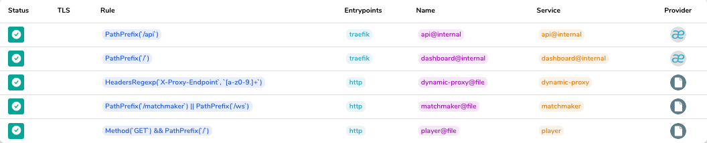

# Pixel Streaming Router

This service uses [traefik:v2.5](https://doc.traefik.io) and simple configurations for the pixel streaming microservices routing

## Contents

| File | About |
|--|--|
| [./config/traefik.yml] | Main router/services for the `http` entrypoint that exposes `player`, `matchmaker` |
| [./config/pod-proxy.yml] | Optional router/services for the `http` entrypoint that exposes the [pod proxy](../proxy) service |

> **NOTE:** A Dockerfile is explicitly omitted from this layer, as it's not necessary
## Runtime

In a `traefik:v2.5` container, simply mount the `traefik.yml` file to `/config/traefik.yml` and run as follows:

```sh
traefik \
  --entrypoints.http.address=:80 \
  --providers.file.directory=/config
```

Optionally include the pod proxy configuration `pod-proxy.yml` if needed.

> Read more information about the dynamic [../proxy/](../proxy/) service

A sample traefik dashboard looks like this when all options are configured:



### Configuration

| Variable | About | Required | Default |
|--|--|--|
| `WEB_PATH_PREFIX` | Prefix for web (client) static service | N | `/` |
| `SOCKET_PATH_PREFIX` | Prefix for websocket service URI (relative to web) | N | `/ws` |
| `PLAYER_ADDRESS` | Player service url (ie: `player:8080`) | Y | |
| `MATCHMAKER_ADDRESS` | Matchmaker service url (ie: `matchmaker:3000`)  | Y | |
| `PROXY_ENABLE` | Proxy service address. The proxy is excluded if empty | N | `false` |
| `PROXY_ADDRESS` | Specify the pod proxy service address | N | |
| `PROXY_PATH_PREFIX` | Path prefix for dynamic proxy service | N | `/proxy` |
| `PROXY_AUTH_USERS` | Restrict proxy traffic as comma-separated [basic auth](https://doc.traefik.io/traefik/middlewares/http/basicauth/) users | N |  |

> **NOTE** the provided `player` service expects the websocket path to be `/ws`
relative to the player itself. If changing socket path, be sure to adjust the
player `app.js` accordingly.
